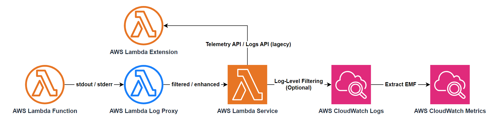

# AWS Lambda Log Filter

A lambda layer to save your money.

> Powered by [AWS Lambda Log Proxy](https://github.com/DiscreteTom/aws-lambda-log-proxy).

## Usage

### As a Lambda Layer

1. Build this project to executable binary via `cargo build --release`. Or check the pre-built binaries in the [release page](https://github.com/DiscreteTom/aws-lambda-log-filter/releases/latest).
2. Zip `scripts/entry.sh` and `target/release/aws-lambda-log-filter` and upload it as a lambda layer.
3. Add an environment variable `AWS_LAMBDA_EXEC_WRAPPER` to the lambda function with the value `/opt/entry.sh` to enable the filter process.
4. Configure the following environment variables to filter the logs.

### Environment Variables

- `AWS_LAMBDA_LOG_FILTER_FILTER_BY_PREFIX`
  - If set, only log lines that start with this prefix will be kept.
- `AWS_LAMBDA_LOG_FILTER_IGNORE_BY_PREFIX`
  - If set, log lines that start with this prefix will be ignored.
- `AWS_LAMBDA_LOG_FILTER_FILTER_BY_REGEX`
  - If set, only log lines that match this regex will be kept.
  - The regex must be a valid [rust regex](https://docs.rs/regex/latest/regex/#syntax).
  - Keep the regex simple to avoid performance issues.
- `AWS_LAMBDA_LOG_FILTER_IGNORE_BY_REGEX`
  - If set, log lines that match this regex will be ignored.
  - The regex must be a valid [rust regex](https://docs.rs/regex/latest/regex/#syntax).
  - Keep the regex simple to avoid performance issues.
- `AWS_LAMBDA_LOG_FILTER_WRAP_IN_JSON_LEVEL`
  - If set, log lines will be wrapped in JSON with this value as the log level.
  - E.g. `INFO`, `ERROR`, `DEBUG`, etc.
- `AWS_LAMBDA_LOG_FILTER_DISABLE_LAMBDA_TELEMETRY_LOG_FD_FOR_HANDLER`
  - If set to `true`, the lambda telemetry log file descriptor will be disabled for the handler.
  - If you find the filter is not working (especially in nodejs), try to set this to `true`.

### Best Practices

- If you already enabled Lambda JSON format logging, or you are able to modify your code to use JSON format logging, you should avoid using this lambda layer. Please use the built-in JSON log-level filtering.
- Avoid to log JSON format logs in the lambda function, because the log filter will parse JSON format lines to check if the line is [EMF](https://docs.aws.amazon.com/AmazonCloudWatch/latest/monitoring/CloudWatch_Embedded_Metric_Format_Specification.html) or not, which is costly. But you can set `AWS_LAMBDA_LOG_FILTER_WRAP_IN_JSON_LEVEL` in the environment variables to wrap the log lines in JSON format.
- If you want to use the built-in JSON log-level filtering with this filter simultaneously, after you enable the Lambda JSON format logging, you should set `AWS_LAMBDA_LOG_FORMAT` to `TEXT` in the environment variables to log in text format, then set `AWS_LAMBDA_LOG_FILTER_WRAP_IN_JSON_LEVEL` to the log level you want to filter.
- Increase the memory of your lambda function to obtain more CPU power to balance the cost of the lambda layer.

## FAQ

- Q: The filter configuration is not working, all logs are still there.
  - Try to set `AWS_LAMBDA_LOG_FILTER_DISABLE_LAMBDA_TELEMETRY_LOG_FD_FOR_HANDLER` to `true`.

## [CHANGELOG](./CHANGELOG.md)
